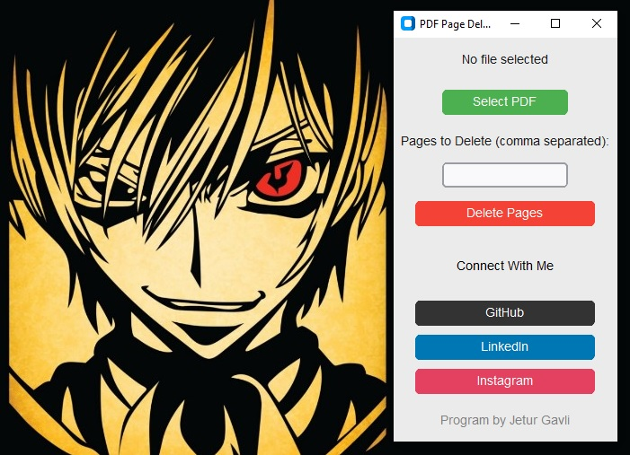

# PDF Page Deleter

PDF Page Deleter is a simple desktop application built with Python and Tkinter that allows users to delete specific pages from a PDF file.

## Features

- Select a PDF file to process.
- Specify pages to delete (comma separated).
- Save the modified PDF file.
- Easy-to-use graphical interface.

## Prerequisites

Make sure you have the following installed:

- Python 3.x
- Tkinter (usually included with Python installations)
- PyPDF2

## Installation

1. Clone the repository or download the source code.
2. Install the required Python package:

```sh
    pip install -r requirements.txt
```

## Usage

1. Run the main.py script:

    ```bash
    python main.py
    ```

2. Use the graphical interface to

- Select PDF: Open a file dialog to select the PDF file you want to modify.
- Pages to Delete: Enter the pages you want to delete (comma separated).
- Delete Pages: Delete the specified pages and save the modified PDF.
- Connect With Me: Visit the developer's GitHub, LinkedIn, and Instagram profiles.

## UI



## Project Feature Contributing

Contributions are welcome! If you have any suggestions, feature requests, or found a bug, please open an issue or submit a pull request.

## Please Support 💓

If you find this project useful, please consider giving it a star. Your support is greatly appreciated and helps us grow! 🌟🌟🌟🌟🌟🌟

## Credits and Autor

This project is created by [Jetur Gavli](https://github.com/jeturgavli).

## License

This project is licensed under the MIT License - see the [LICENSE](LICENSE) file for details.
